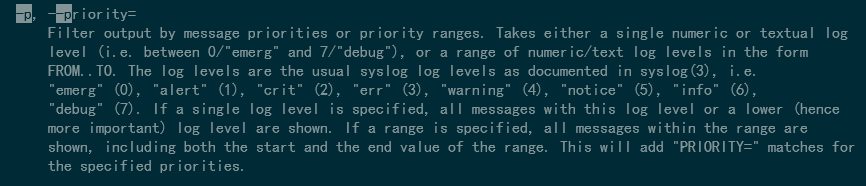

## EXAM_2420

# Question 1
```
sudo apt update
sudo apt upgrade
```

# Question 2


# Question 3



# Question 4
```
  #!/bin/bash
  
  users=$(awk -F: '/\/home/ {print $1}' /etc/passwd)
  echo "regular users on the system are:" > motd
  for user in $users
  do
          if [ $user != syslog ]; then
                   echo $user $UID $SHELL >> motd
          fi
 done
 echo >> motd
 echo Users currently logged in are: >> motd
 echo $USER >> motd
 ```
File sits in /opt
# Question 5
```
    [Unit]
    Description=My Script Service
    [Service]
    Type=simple
    ExecStart=/home/vagrant/bin/part5
    [Install]
    WantedBy=multi-user.target
```
This file goes to /etc/systemd/system


# Question 6
```
  [Unit]
  Description=My Timer
  
  [Timer]
  OnBootSec=1min
  OnUnitActiveSec=1d
  
  [Install]
  WantedBy=timers.target
                       
```
This file goes to /etc/systemd/system

